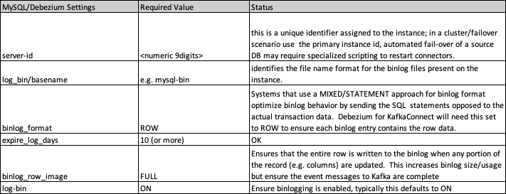

## Source Database Configuration
This database instance represents the source of content for replication and requires specific configuration settings to ensure access and full transaction details are sent to the MySQL binlog tx file.  For this example debezium is being used as for Kafka Connect plugin and MySQL as the source instance, however the process for configuring alternative RDBMS sources is quite similar.   Please see the below debezium documentation for configuring alternative RDBMS databases.
 
 
Note this configuration is related to the Source RDBMS MySQL instance, see the KafkaConnectSource directory for KafkaConnect setup. 
#### Debezium connector for MySQL Documentation
-   https://debezium.io/documentation/reference/stable/connectors/mysql.html
  
TL&DR 
Below represents the content and configuration necessary for configuration,
in addition a database user account must  be create or authorized to support the below functionality.   For a standard RDS / MySQL instance you will like need to update the  DB instance parameter group settings for enabling binlog formats requiring a new or updated parameter group and subsequent  reboot of the RDS instance.
   
* show variables like 'binlog_format'   ; -- ROW
* show variables like 'binlog_row_image'  ; -- FULL
* show variables like 'log_bin'  ; -- ON
* show global variables like '%log_bin_basename%'  ; -- def mysql-bin-changelog
* show variables like 'server_id'  ; --    1691652969
* show variables like 'expire_logs_days'  ; -- e.g. 10 days

mysql> CREATE USER 'user'@'localhost' IDENTIFIED BY 'password';

mysql> GRANT SELECT, RELOAD, SHOW DATABASES, REPLICATION SLAVE, REPLICATION CLIENT ON *.* TO 'user' IDENTIFIED BY 'password';

### MySQL Configuration
#### binlog_format and binlog_row_image
The MySQL binlog contains committed transaction data
for the given instance and also represents the source data 
for the Kafka Source Connector. By default bin-log is
enabled and will write application data and 
transaction metadata to the log on successful DML/DDL/CRUD
operations. However there are some instances when a transaction
may only record the logical statement used opposed to
the detailed data (e.g. Update <table name> set status =1)
This can occur if the binlog-format configuration is
set to MIXED or STATEMENT, which is often done for 
stand-by configuration.  As such the following     
configuration must be set.
                                                   
#### binlog_format=ROW

Another aspect relating to the transaction log contents is the 
binlog-row-image which can be optimized to contain only the 
specific columns that were changed opposed to the
entire record.  This too can offer efficiences by reducing 
the level of data written but will leave the connector 
with inconsistent messsage formats and is not currently allowed.

#### binlog_row-image=FULL

Overall it is also important to note that transactional
databases typically only update smaller
record sets and the amount of transactional
 data writeen is small. However, for analytical and batch 
system that need to perform large update and/or
non-logging bulk loads that by-passing the transaction
log this may cause issues.  
In these  larger transactions situations, these 
changes to the binlog
 parameters can cause higher latency in the MySQL
database effecting the driving application as well.
Finally, it must also be said that this replication 
scheme is highly reliable and 
if Service Levels associated with the
source and/or target application(s) are not strict
this can still represent a very straight-forward approach
for replication.

the initial source of data for replication 
Enabling the debezium KafkaConnector requires 
updates or configuration of the database instance.
This example looks at the configuration for MySQL 
but others database source work similarly and can
be reviewed at the below link.  In addition to DB 
configuration changes a user should be created 
with specific credentials to access the current and archived binlogs
provided below.

MySQL DB parameter settings.

Below are the user account privileges required for the MSK Kafka debezium connector.

